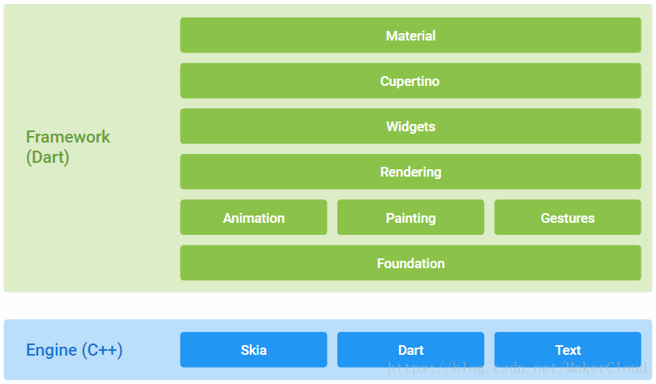
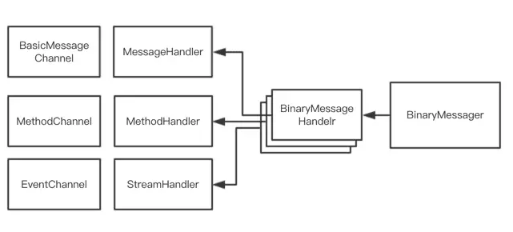
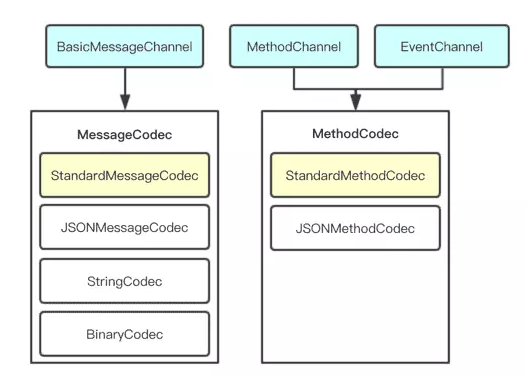
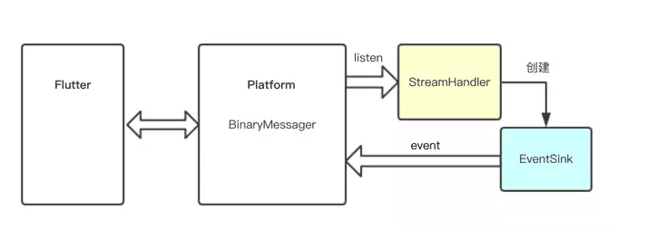
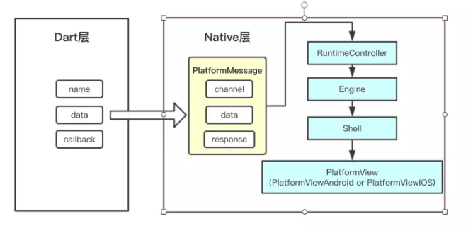

# Flutter Channel&&集成

[TOC]


## Plugin 通信原理
* 在介绍Plugin前，我们先简单了解一下Flutter：

 

* Flutter框架包括：Framework和Engine，他们运行在各自的Platform上。
* Framework是Dart语言开发的，包括Material Design风格的Widgets和Cupertino(iOS-style)风格的Widgets，以及文本、图片、按钮等基础Widgets；还包括渲染、动画、绘制、手势等基础能力。
* Engine是C++实现的，包括Skia（二维图形库）；Dart VM（Dart Runtime）；Text（文本渲染）等。
> 实际上，Flutter的上层能力都是Engine提供的。Flutter正是通过Engine将各个Platform的差异化抹平。而我们今天要讲的Plugin，正是通过Engine提供的Platform Channel实现的通信。


* Plugin其实就是一个特殊的Package。Flutter Plugin提供Android或者iOS的底层封装，在Flutter层提供组件功能，使Flutter可以较
方便的调取Native的模块。很多平台相关性或者对于Flutter实现起来比较复杂的部分，都可以封装成Plugin。其原理如下

 

通过上图，我们看到Flutter App是通过Plugin创建的Platform Channel调用的Native APIs。

### Platform Channel：

1. Flutter App (Client)，通过MethodChannel类向Platform发送调用消息；
2. Android Platform (Host)，通过MethodChannel类接收调用消息；
3. iOS Platform (Host)，通过FlutterMethodChannel类接收调用消息。

> PS：消息编解码器，是JSON格式的二进制序列化，所以调用方法的参数类型必须是可JSON序列化的。
> PS：方法调用，也可以反向发送调用消息。
* Android Platform
  
    > FlutterActivity，是Android的Plugin管理器，它记录了所有的Plugin，并将Plugin绑定到FlutterView。

### 理解Platform Channel工作原理
* Flutter定义了三种不同类型的Channel，它们分别是

* BasicMessageChannel：用于传递字符串和半结构化的信息。
* MethodChannel：用于传递方法调用（method invocation）。
* EventChannel: 用于数据流（event streams）的通信。

三种Channel之间互相独立，各有用途，但它们在设计上却非常相近。每种Channel均有三个重要成员变量：

* name:  String类型，代表Channel的名字，也是其唯一标识符。
* messager：BinaryMessenger类型，代表消息信使，是消息的发送与接收的工具。
* codec: MessageCodec类型或MethodCodec类型，代表消息的编解码器。

#### Channel name
   一个Flutter应用中可能存在多个Channel，每个Channel在创建时必须指定一个独一无二的name，Channel之间使用name来区分彼此。当有消息从Flutter端发送到Platform端时，会根据其传递过来的channel name找到该Channel对应的Handler（消息处理器）。
#### 消息信使:BinaryMessenger



虽然三种Channel各有用途，但是他们与Flutter通信的工具却是相同的，均为BinaryMessager。
* BinaryMessenger是Platform端与Flutter端通信的工具，其通信使用的消息格式为二进制格式数据。当我们初始化一个Channel，并向该Channel注册处理消息的Handler时，实际上会生成一个与之对应的BinaryMessageHandler，并以channel name为key，注册到BinaryMessenger中。当Flutter端发送消息到BinaryMessenger时，BinaryMessenger会根据其入参channel找到对应的BinaryMessageHandler，并交由其处理。
* Binarymessenger在Android端是一个接口，其具体实现为FlutterNativeView。而其在iOS端是一个协议，名称为FlutterBinaryMessenger，FlutterViewController遵循了它。
* Binarymessenger并不知道Channel的存在，它只和BinaryMessageHandler打交道。而Channel和BinaryMessageHandler则是一一对应的。由于Channel从BinaryMessageHandler接收到的消息是二进制格式数据，无法直接使用，故Channel会将该二进制消息通过Codec（消息编解码器）解码为能识别的消息并传递给Handler进行处理。
* 当Handler处理完消息之后，会通过回调函数返回result，并将result通过编解码器编码为二进制格式数据，通过BinaryMessenger发送回Flutter端。


#### 消息编解码器:Codec



   消息编解码器Codec主要用于将二进制格式的数据转化为Handler能够识别的数据，Flutter定义了两种Codec：MessageCodec和MethodCodec。
#####  MessageCodec
   MessageCodec用于二进制格式数据与基础数据之间的编解码。BasicMessageChannel所使用的编解码器就是MessageCodec。
​   Android中，MessageCodec是一个接口，定义了两个方法:encodeMessage接收一个特定的数据类型T，并将其编码为二进制数据ByteBuffer，而decodeMessage则接收二进制数据ByteBuffer，将其解码为特定数据类型T。iOS中，其名称为FlutterMessageCodec，是一个协议，定义了两个方法：encode接收一个类型为id的消息，将其编码为NSData类型，而decode接收NSData类型消息，将其解码为id类型数据。
​   MessageCodec有多种不同的实现：


#####  BinaryCodec
BinaryCodec是最为简单的一种Codec，因为其返回值类型和入参的类型相同，均为二进制格式（Android中为ByteBuffer，iOS中为NSData）。实际上，BinaryCodec在编解码过程中什么都没做，只是原封不动将二进制数据消息返回而已。或许你会因此觉得BinaryCodec没有意义，但是在某些情况下它非常有用，比如使用BinaryCodec可以使传递内存数据块时在编解码阶段免于内存拷贝。


#####  StringCodec
StringCodec用于字符串与二进制数据之间的编解码，其编码格式为UTF-8。


* JSONMessageCodec
    * JSONMessageCodec用于基础数据与二进制数据之间的编解码，其支持基础数据类型以及列表、字典。其在iOS端使用了NSJSONSerialization作为序列化的工具，而在Android端则使用了其自定义的JSONUtil与StringCodec作为序列化工具。


* StandardMessageCodec
    * StandardMessageCodec是BasicMessageChannel的默认编解码器，其支持基础数据类型、二进制数据、列表、字典，其工作原理会在下文中详细介绍。


#####   MethodCodec
   MethodCodec用于二进制数据与方法调用(MethodCall)和返回结果之间的编解码。MethodChannel和EventChannel所使用的编解码器均为MethodCodec。
​   与MessageCodec不同的是，MethodCodec用于MethodCall对象的编解码，一个MethodCall对象代表一次从Flutter端发起的方法调用。MethodCall有2个成员变量：String类型的method代表需要调用的方法名称，通用类型(Android中为Object，iOS中为id)的arguments代表需要调用的方法入参。
​   由于处理的是方法调用，故相比于MessageCodec，MethodCodec多了对调用结果的处理。当方法调用成功时，使用encodeSuccessEnvelope将result编码为二进制数据，而当方法调用失败时，则使用encodeErrorEnvelope将error的code、message、detail编码为二进制数据。
​   MethodCodec有两种实现：


* JSONMethodCodec
    * JSONMethodCodec的编解码依赖于JSONMessageCodec，当其在编码MethodCall时，会先将MethodCall转化为字典{"method":method,"args":args}。其在编码调用结果时，会将其转化为一个数组，调用成功为[result]，调用失败为[code,message,detail]。再使用JSONMessageCodec将字典或数组转化为二进制数据。


* StandardMethodCodec
    * MethodCodec的默认实现，StandardMethodCodec的编解码依赖于StandardMessageCodec，当其编码MethodCall时，会将method和args依次使用StandardMessageCodec编码，写入二进制数据容器。其在编码方法的调用结果时，若调用成功，会先向二进制数据容器写入数值0（代表调用成功），再写入StandardMessageCodec编码后的result。而调用失败，则先向容器写入数据1（代表调用失败），再依次写入StandardMessageCodec编码后的code，message和detail。


####   消息处理器：Handler
   当我们接收二进制格式消息并使用Codec将其解码为Handler能处理的消息后，就该Handler上场了。Flutter定义了三种类型的Handler，与Channel类型一一对应。我们向Channel注册一个Handler时，实际上就是向BinaryMessager注册一个与之对应的BinaryMessageHandler。当消息派分到BinaryMessageHandler后，Channel会通过Codec将消息解码，并传递给Handler处理。
#####  . MessageHandler
   MessageHandler用户处理字符串或者半结构化的消息，其onMessage方法接收一个T类型的消息，并异步返回一个相同类型result。MessageHandler的功能比较基础，使用场景较少，但是其配合BinaryCodec使用时，能够方便传递二进制数据消息。
#####   MethodHandler
   MethodHandler用于处理方法的调用，其onMessage方法接收一个MethodCall类型消息，并根据MethodCall的成员变量method去调用对应的API，当处理完成后，根据方法调用成功或失败，返回对应的结果。

#####  StreamHandler

 


*   StreamHandler与前两者稍显不同，用于事件流的通信，最为常见的用途就是Platform端向Flutter端发送事件消息。当我们实现一个StreamHandler时，需要实现其onListen和onCancel方法。而在onListen方法的入参中，有一个EventSink（其在Android是一个对象，iOS端则是一个block）。我们持有EventSink后，即可通过EventSink向Flutter端发送事件消息。
 ​   实际上，StreamHandler工作原理并不复杂。当我们注册了一个StreamHandler后，实际上会注册一个对应的BinaryMessageHandler到BinaryMessager。而当Flutter端开始监听事件时，会发送一个二进制消息到Platform端。Platform端用MethodCodec将该消息解码为MethodCall，如果MethodCall的method的值为"listen"，则调用StreamHandler的onListen方法，传递给StreamHandler一个EventSink。而通过EventSink向Flutter端发送消息时，实际上就是通过BinaryMessager的send方法将消息传递过去。
####   理解消息编解码过程
 ​   在官方文档《Writing custom platform-specific code with platform channels》中的获取设备电量的例子中我们发现，Android端的返回值是java.lang.Integer类型的，而iOS端返回值则是一个NSNumber类型的（通过NSNumber numberWithInt:获取）。而到了Flutter端时，这个返回值自动"变成"了dart语言的int类型。那么这中间发生了什么呢？
 ​   Flutter官方文档表示，standard platform channels使用standard messsage codec对message和response进行序列化和反序列化，message与response可以是booleans, numbers, Strings, byte buffers,List, Maps等等，而序列化后得到的则是二进制格式的数据。
 ​   所以在上文提到的例子中，java.lang.Integer或NSNumber类型的返回值先是被序列化成了一段二进制格式的数据，然后该数据传递到传递到flutter侧后，被反序列化成了dart语言中的int类型的数据。
 ​   Flutter默认的消息编解码器是StandardMessageCodec,其支持的数据类型如下：


* 平台通道数据类型支持和解码器
* 标准平台通道使用标准消息编解码器，以支持简单的类似JSON值的高效二进制序列化，例如 booleans,numbers, Strings, byte buffers, List, Maps（请参阅StandardMessageCodec了解详细信息）。 当您发送和接收值时，这些值在消息中的序列化和反序列化会自动进行。

下表显示了如何在宿主上接收Dart值，反之亦然：

|Dart	|Android|	iOS|
|---|---|---|
|null	|null	|nil (NSNull when nested)|
|bool	|java.lang.Boolean	|NSNumber numberWithBool:|
|int	|java.lang.Integer	|NSNumber numberWithInt:|
|int, if 32 bits not enough	|java.lang.Long	|NSNumber numberWithLong:|
|int, if 64 bits not enough	|java.math.BigInteger	|FlutterStandardBigInteger|
|double	|java.lang.Double	|NSNumber numberWithDouble:|
|String	j|ava.lang.String	|NSString|
|Uint8List	|byte[]	|FlutterStandardTypedData typedDataWithBytes:|
|Int32List	|int[]	|FlutterStandardTypedData typedDataWithInt32:|
|Int64List	|long[]	|FlutterStandardTypedData typedDataWithInt64:|
|Float64List	|double[]	|FlutterStandardTypedData typedDataWithFloat64:|
|List	|java.util.ArrayList	|NSArray|
|Map	|java.util.HashMap	|NSDictionary|

* 当message或response需要被编码为二进制数据时，会调用StandardMessageCodec的writeValue方法，该方法接收一个名为value的参数，并根据其类型，向二进制数据容器(NSMutableData或ByteArrayOutputStream)写入该类型对应的type值，再将该数据转化为二进制表示，并写入二进制数据容器。
​   而message或者response需要被解码时，使用的是StandardMessageCodec的readValue方法，该方法接收到二进制格式数据后，会先读取一个byte表示其type，再根据其type将二进制数据转化为对应的数据类型。
​   在获取设备电量的例子中，假设设备的电量为100，当这个值被转化为二进制数据时，会先向二进制数据容器写入int类型对应的type值:3，再写入由电量值100转化而得的4个byte。而当Flutter端接收到该二进制数据时，先读取第一个byte值，并根据其值得出该数据为int类型，接着，读取紧跟其后的4个byte，并将其转化为dart类型的int。

     

* 对于字符串、列表、字典的编码会稍微复杂一些。字符串使用UTF-8编码得到的二进制数据是长度不定的，因此会在写入type后，先写入一个代表二进制数据长度的size，再写入数据。列表和字典则是写入type后，先写入一个代表列表或字典中元素个数的size，再递归调用writeValue方法将其元素依次写入。
###   理解消息传递过程
   消息是如何从Flutter端传递到Platform端的呢？接下来我们以一次MethodChannel的调用为例，去理解消息的传递过程。
*  消息传递：从Flutter到Platform
#####  Dart层
   当我们在Flutter端使用MethodChannel的invokeMethod方法发起一次方法调用时，就开始了我们的消息传递之旅。invokeMethod方法会将其入参message和arguments封装成一个MethodCall对象，并使用MethodCodec将其编码为二进制格式数据，再通过BinaryMessages将消息发出。（注意，此处提到的类名与方法名均为dart层的实现）
​   上述过程最终会调用到ui.Window的_sendPlatformMessage方法，该方法是一个native方法，其实现在native层，这与Java的JNI技术非常类似。我们向native层发送了三个参数：


* name，String类型，代表Channel名称
* data，ByteData类型，即之前封装的二进制数据
* callback，Function类型，用于结果回调

#####  Native层
   到native层后，window.cc的SendPlatformMessage方法接受了来自dart层的三个参数，并对它们做了一定的处理：dart层的回调callback封装为native层的PlatformMessageResponseDart类型的response；dart层的二进制数据data转化为std::vector<uint8_t>类型数据data；根据response,data以及Channel名称name创建一个PlatformMessage对象，并通过dart_state->window()->client()->HandlePlatformMessage方法处理PlatformMessage对象。
​   dart_state->window()->client()是一个WindowClient，而其具体的实现为RuntimeController，RuntimeController会将消息交给其代理RuntimeDelegate处理。
​   RuntimeDelegate的实现为Engine，Engine在处理Message时，会判断该消息是否是为了获取资源（channel等于"flutter/assets"）,如果是，则走获取资源逻辑，否则调用Engine::Delegate的OnEngineHandlePlatformMessage方法。
​   Engine::Delegate的具体实现为Shell，其OnEngineHandlePlatformMessage接收到消息后，会向PlatformTaskRunner添加一个Task，该Task会调用PlatformView的HandlePlatformMessage方法。值得注意的是，Task中的代码执行在Platform Task Runner中，而之前的代码均执行在UI Task Runner中。

   

#####  消息处理
 ​   PlatformView的HandlePlatformMessage方法在不同平台有不同的实现，但是其基本原理是相同的。
#####  . PlatformViewAndroid
 ​   PlatformViewAndroid的是Platformview的子类，也是其在Android端的具体实现。当PlatformViewAndroid接收到PlatformMessage类型的消息时，如果消息中有response（类型为PlatformMessageResponseDart），则生成一个自增长的response_id,并以response_id为key，response为value存入字典pending_responses_中。接着，将channel和data均转化为Java可识别的数据，通过JNI向Java层发起调用，将response_id、channel和data传递过去。
 ​   Java层中，被调用的代码为FlutterNativeView (BinaryMessager的具体实现)的handlePlatformMessage，该方法会根据channel找到对应的BinaryMessageHandler并将消息传递给它处理。其具体处理过程我们已经在上文中详细分析过了，此处不再赘述。
 ​   BinaryMessageHandler处理完成后，FlutterNativeView会通过JNI调用native的方法，将response_data和response_id传递到native层。
 ​   native层，PlatformViewAndroid的InvokePlatformMessageResponseCallback接收到了respond_id和response_data。其先将response_data转化为二进制结果，并根据response_id，从panding_responses_中找到对应的PlatformMessageResponseDart对象，调用其Complete方法将二进制结果返回。

    

#####   PlatformViewIOS
   PlatformViewIOS是PlatformView的子类，也是其在iOS端的具体实现，当PlatformViewIOS接收到message时会交给PlatformMessageRouter处理。
​   PlatformMessageRouter通过PlatformMessage中的channel找到对应的FlutterBinaryMessageHandler，并将二进制消息其处理，消息处理完成后，直接调用PlatformMessage对象中的PlatformMessageResponseDart对象的Complete方法将二进制结果返回。
#####   结果回传：从Platform到Flutter
   PlatformMessageResponseDart的Complete方法向UI Task Runner添加了一个新的Task，这个Task的作用是将二进制结果从native的二进制数据类型转化为Dart的二进制数据类型response，并调用dart的callback将response传递到Dart层。
​   Dart层接收到二进制数据后，使用MethodCodec将数据解码，并返回给业务层。至此，一次从Flutter发起的方法调用就完整结束了。

## 原生工程集成Flutter

对与方便的进行Flutter的混合模式开发呼声有多高，Google专门为了这个问题建立了Wiki并且进行了持续4个月42个版本的更新。
创建Flutter Module模式

### Step 1: 创建Flutter module模版

```
flutter create -t module flutter_module
```

复制代码这个时候会看到project中新增加了一个flutter_module，其中包含了.android,.ios和关键的include_flutter.groovy文件

### Step 2: 将Flutter添加到现有工程中


在android工程的根目录的settings.gradle中添加,这里有坑？

```
include ':app'                                     // assumed existing content
setBinding(new Binding([gradle: this]))                                 // new
evaluate(new File(                                                      // new
  settingsDir.parentFile,                                               // new
  'flutter_module/.android/include_flutter.groovy'                      // new
)) 
```

在app的build.gradle中添加依赖

```
dependencies {
  implementation project(':flutter')
```

简单的说，Google在兼顾维护成本和开发成本的前提下，为了Insert  flutter module ,建立了一个逻辑依赖链

```
flutter_module/.android/include_flutter.groovy ->
flutter_module/.android/Flutter/build.gradle ->
$flutterRoot/packages/flutter_tools/gradle/flutter.gradle 
```

利用``` $flutterRoot/packages/flutter_tools/lib/```中的```flutter command``` &&
```$AndroidRoot/build-tools/buildToolsVersion/```中的```android command```
完成混合开发模式下的打包操作。


